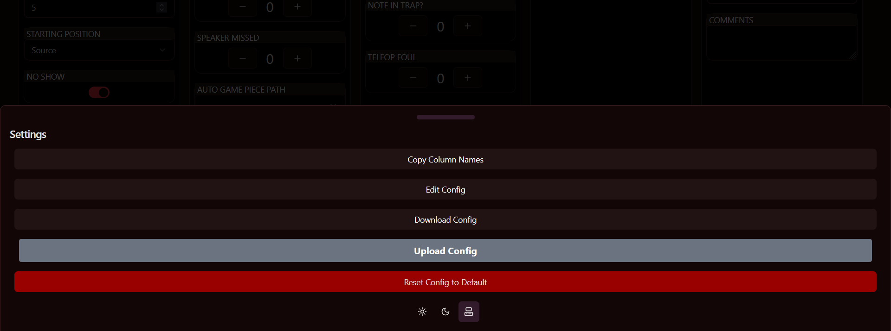

# NOTE

We changed to github pages. Please use https://frc2713.github.io/QRScout/ until we redirect http://scout.redhawkrobotics.org

# QRScout

A QR Code-based scouting system for FRC

## Getting started

QRScout is a web app. To open it, all you have to do is visit https://frc2713.github.io/QRScout/

QRScout takes in form data inputed durring a FRC match about the robots playing it, and outputs a QR code with all of that data, in a list seperated by default by tabs. The QR code generated can then be scanned and inputted into something like a Microsoft Excel or Google Sheets spreadsheet, and analyzed.

## Using QRScout

When you visit QRScout, you're shown a screen that looks something like

At the top, and taking up most of the page, are form fields. These are the input for the data that will later be made into a QRCode.

Some of these fields are required, and others aren't. QRScout will refuse to let you submit the form until all of the required fields are filled out.


Down at the bottom of the page, there is the Commit, Reset Form, and Settings buttons. The Commit button will generate a QR code of the form data that you filled out above, and display this onscreen to be scanned, alongside the text that is encoded in the QR code. The Reset Form button resets most of the form fields, so that it can be used again without havng to reload the page. It does not reset the Prematch column, as most of this data can be reused from match to match.

> ![NOTE]
> The line delimiter in the text alongside the QRCode is always a pipe, regardless of what it set to. In the QRCode, however, it will be what you have set it to.

The Settings button brings up the Settings menu at the bottom of your screen:


This has a number of buttons on it:

- Copy Column Names: Copies the names of the columns to your clipboard
- Edit Config: Edit the config.json file
- Download Config: Download the config.json file
- Upload Config: Upload a config.json file
- Reset Config to Default: Resets the config.json file to the default

Beneath these, there are three buttons that control if QRScout is in light mode, dark mode, or your system's dark/light mode setting. By default, this is set to your system.

## config.json

The config.json file is what configures the form fields for QRScout, the page title, the title at the top of your screen, and the line delimiter used in the QRCode.

The config.json can be edited to change most parts of QRScout, and change the line delimiter character used by the QRCode.

The basic structure of the config.json file is as follows:

Root:
$schema: A refrence to the schema used by the config.json file. This shouldn't be changed from the default "../schema.json".
title: The title of the page. This is what appears in the tab bar.
page_title: The title that appears at the top of the QRScout page.
delimiter: The line delimiter used by the QR code
sections: An array of sections/columns that hold and organize form inputs

Induvidual sections:
name: The name of the section/column
preserveDataOnReset: If the data in this section is preserved when the Reset Form button is pressed.
fields: An array of fields, which describe form inputs.

Induvidual fields:
title: The name of this field
type: One of "text", "number", "boolean", "range", "select", "counter", "image" or "timer". Describes the type of input this is.
required: a boolean indicating if this must be filled out before the QRCode is generated. If any field with this set to true is not filled out, QRScout will not generate a QRCode when the commit button is pressed.
code: camelCase string with a unique name indicaing what this field is.
disabled: Boolean indicating if this field is disabled. If it is, things cannot be inputted into it. This and the requied value are mutually exclusive if you want people to be able to submit this form.
preserveDataOnReset: If the data in this field is preserved when the Reset Form button is pressed.
choices: An object containng numbered keys mapping to values that this can hold. For example:

```json
"choices": {
    "1": "First option",
    "2": "Second option"
}
```

defaultValue: The default value of this field.
