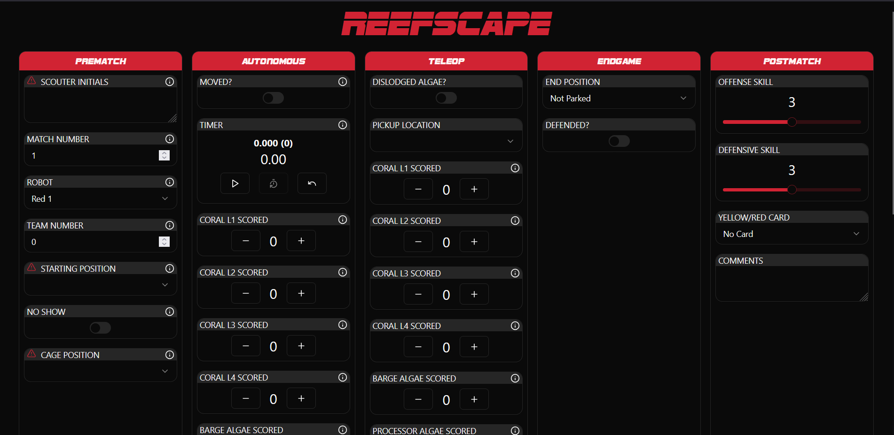
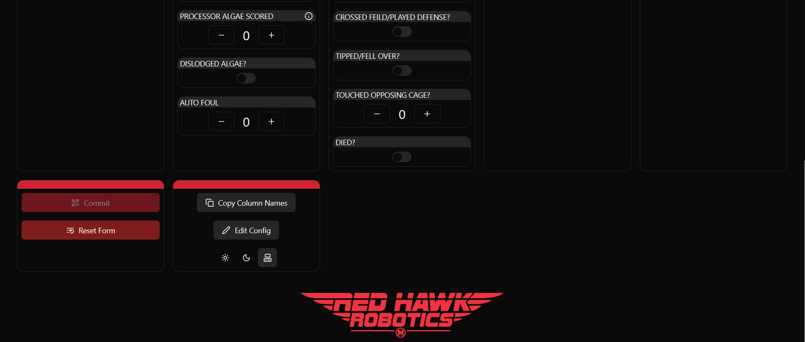
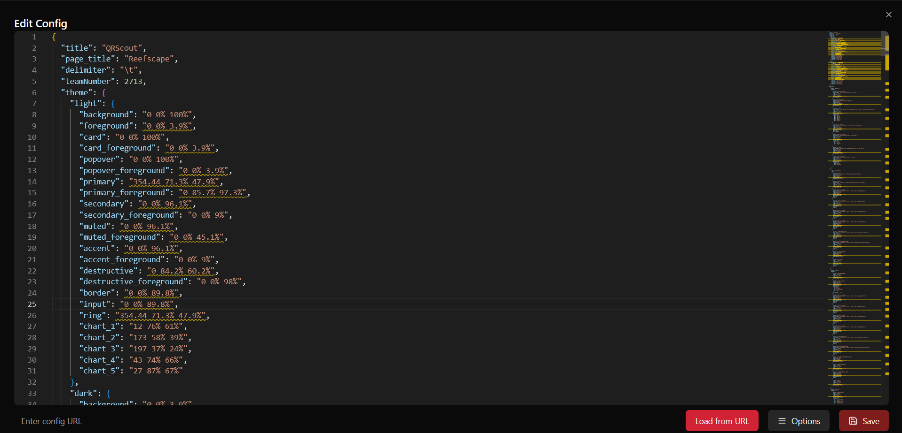
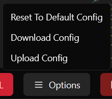

# NOTE

We changed to github pages. Please use https://frc2713.github.io/QRScout/ until we redirect http://scout.redhawkrobotics.org

# QRScout

A QR Code-based scouting system for FRC

## Table of Contents

- [Getting Started](#getting-started)
- [Using QRScout](#using-qrscout)
  - [Hosting a Custom JSON Config](#hosting-a-custom-json-config-for-your-team)
- [config.json](#configjson)
  - [Root](#root)
  - [Individual Sections](#individual-sections)
  - [Individual Fields](#individual-fields)
  - [Using Multi-Select Input](#using-multi-select-input)
  - [Using Image Input](#using-image-input)
  - [Using Timer Input](#using-timer-input)

## Getting started

QRScout is a web app. To open it, all 3you have to do is visit https://frc2713.github.io/QRScout/

QRScout takes in form data inputed durring a FRC match about the robots playing it, and outputs a QR code with all of that data, in a list seperated by default by tabs. The QR code generated can then be scanned and inputted into something like a Microsoft Excel or Google Sheets spreadsheet, and analyzed.

## Using QRScout

When you visit QRScout, you're shown a screen that looks something like

At the top, and taking up most of the page, are form fields. These are the input for the data that will later be made into a QRCode.

Some of these fields are required, and others aren't. QRScout will refuse to let you submit the form until all of the required fields are filled out.


Down at the bottom of the page, there are the Commit and Reset Form buttons. The Commit button will generate a QR code of the form data that you filled out above, and display this onscreen to be scanned, alongside the text that is encoded in the QR code. The Reset Form button resets most of the form fields, so that it can be used again without havng to reload the page. It does not reset most of the Prematch column, as most of this data can be reused from match to match.

There are also the Copy Column Names and Edit Config buttons. Clicking Copy Column Names will do what it suggests, and copy the names of each column to your clipboard. The Edit Config button leads you to the `config.json` editor. The three buttons beneath this are used to change from light to dark mode, and set the page to your system theme (the default).

> The line delimiter in the text alongside the QRCode is always a comma, regardless of what it set to. In the data in the QRCode and optionally copied to your clipboard, it will be what you have set it to.

Clicking on Edit Config leads you to the following screen:

The text editor allows you to edit the `config.json` file (see below). Click the Save button to save any changes you make.

Once you create a custom `config.json` file for your team, there are 2 ways to leverage it in competition:

1. Download the custom `config.json` file to each tablet / device for your scouts and upload it to QRScout using the "Upload Config" button in the options menu.
2. Host the custom `config.json` file in a public GitHub repository and load it into QRScout using the "Load from URL" button in the settings menu.

You can also download the config.json file to your device and reset the config.json to the default.



### Hosting a custom JSON config for your team

To host your JSON config in a GitHub repository and make it available publicly via GitHub Pages, follow these steps:

1. Create a new repository on GitHub or use an existing one.
2. Add your JSON config file to the repository.
3. Enable GitHub Pages for the repository:
   - Go to the repository's "Settings" tab.
   - Scroll down to the "GitHub Pages" section.
   - Select the branch you want to use for GitHub Pages (e.g., `main`).
   - Click "Save".
4. After enabling GitHub Pages, your JSON config file will be available at a URL like `https://<username>.github.io/<repository>/<path-to-config>.json`.

You can now use this URL to load the JSON config in QRScout.

## config.json

The config.json file is what configures the form fields for QRScout, the page title, the title at the top of your screen, and the line delimiter used in the QRCode.

The config.json can be edited to change most parts of QRScout, and change the line delimiter character used by the QRCode.

The basic structure of the config.json file is as follows:

### Root:

`$schema`: A reference to the schema used by the config.json file. This shouldn't be changed from the default "../schema.json".

`title`: The title of the page. This is what appears in the tab bar.

`page_title`: The title that appears at the top of the QRScout page.

`delimiter`: The line delimiter used by the QR code

`sections`: An array of sections/columns that hold and organize form inputs

### Individual sections:

`name`: The name of the section/column

`fields`: An array of fields, which describe form inputs.

### Individual fields:

`title`: The name of this field

`type`: One of "text", "number", "boolean", "range", "select", "counter", "timer", "multi-select", "image", "TBA-team-and-robot", or "TBA-match-number". Describes the type of input this is.

`required`: a boolean indicating if this must be filled out before the QRCode is generated. If any field with this set to true is not filled out, QRScout will not generate a QRCode when the commit button is pressed.

`code`: camelCase string with a unique name indicaing what this field is.

`disabled`: Boolean indicating if this field is disabled. If it is, things cannot be inputted into it. This and the requied value are mutually exclusive if you want people to be able to submit this form.

`formResetBehavior`: One of "reset", "preserve", or "increment".

- `reset` will reset the field whenver the form resets
- `preserve` will retain the current value
- `increment` will increment the value based on the field's settings

`choices`: An object containng numbered keys mapping to values that this can hold. For example:

```json
"choices": {
    "1": "First option",
    "2": "Second option"
}
```

For "multiselect" type fields, these choices represent the available options that can be selected.

`defaultValue`: The default value of this field.

### Using Multi-Select Input

The multi-select input type allows users to select multiple options from a predefined list. This is useful for scenarios where multiple attributes or capabilities need to be recorded simultaneously.

#### Configuration in config.json

To configure a multi-select field in your `config.json`:

```json
{
  "title": "Robot Capabilities",
  "type": "multiselect",
  "required": false,
  "code": "robotCapabilities",
  "choices": {
    "1": "Shooting",
    "2": "Climbing",
    "3": "Intake",
    "4": "Defense",
    "5": "Autonomous"
  },
  "formResetBehavior": "reset",
  "defaultValue": ["1", "3"]
}
```

#### Using Multi-Select in the Form

When using a multi-select input:

1. Click on any option to select it (it will be highlighted)
2. Click on a selected option to deselect it
3. You can select as many options as needed
4. The QR code will include all selected values, separated by a special character

#### Data Format

In the generated QR code, multi-select values are stored as a comma-separated list of the selected choice keys. For example, if "Shooting" (1) and "Climbing" (2) are selected, the QR code will contain `1,2` for that field.

For multi-select fields, the `defaultValue` should be an array of strings representing the keys of the choices you want pre-selected when the form loads.

#### Processing Multi-Select Data

When analyzing the data in spreadsheets:

1. You may want to create separate columns for each possible choice to make analysis easier
2. Use spreadsheet functions to check if a specific value exists in the comma-separated list
3. For example, in Google Sheets, you can use: `=REGEXMATCH(A2, "1")` to check if option "1" was selected in cell A2

This allows for more detailed filtering and statistical analysis of which capabilities or attributes were most common across matches.

#### FRC Scouting Example

Multi-select is particularly useful for FRC scouting in scenarios like:

- **Game Piece Handling**: Track which game pieces a robot can manipulate
- **Scoring Locations**: Record all the places a robot can score (low goal, high goal, etc.)
- **Robot Subsystems**: Document the subsystems observed on a robot
- **Failure Modes**: Track multiple types of failures that might occur during a match
- **Defense Capabilities**: Record specific defensive actions a robot can perform

For example, in a game where robots can score in multiple locations, you might configure:

```json
{
  "title": "Scoring Locations",
  "type": "multi-select",
  "required": true,
  "code": "scoringLocations",
  "choices": {
    "1": "Low Goal",
    "2": "Mid Goal",
    "3": "High Goal",
    "4": "Terminal",
    "5": "Charging Station"
  },
  "formResetBehavior": "reset"
}
```

This allows scouts to quickly record all locations where a robot successfully scored during a match.

### Using Image Input

The image input type allows you to display static images in your scouting form. This is useful for showing field layouts, robot diagrams, game piece locations, or any visual reference that helps scouts accurately record data.

#### Configuration in config.json

To configure an image field in your `config.json`:

```json
{
  "title": "Field Layout",
  "type": "image",
  "required": false,
  "code": "fieldLayout",
  "description": "Reference diagram of the field",
  "defaultValue": "https://example.com/path/to/field-layout.jpg",
  "width": 400,
  "height": 300,
  "alt": "2024 FRC Field Layout Diagram",
  "formResetBehavior": "preserve"
}
```

#### Image Input Properties

- **defaultValue**: The URL to the statically hosted image. This should be a publicly accessible URL.
- **width** (optional): The width of the image in pixels. If not specified, the image will use responsive sizing.
- **height** (optional): The height of the image in pixels. If not specified, the image will maintain its aspect ratio.
- **alt** (optional): Alternative text for the image for accessibility. If not provided, it will use the title.

#### Interactive Features

- **Click to Enlarge**: Users can click on any image to open a full-size version in a dialog. This is particularly useful for detailed diagrams or when images need to be examined more closely.

#### Best Practices for Image Input

1. **Host Images Reliably**: Ensure your images are hosted on a reliable service that will be accessible during competition, even with limited internet connectivity.
2. **Optimize Image Size**: Use appropriately sized and compressed images to ensure fast loading times, especially on tablets or devices with slower connections.
3. **Consider Offline Use**: For critical reference images, consider embedding them directly in your application or providing a local fallback.
4. **Use Descriptive Alt Text**: Provide meaningful alternative text to ensure accessibility for all users.
5. **Provide Context**: Let users know they can click on images to view them in full size, especially for detailed diagrams or maps.

#### FRC Scouting Examples

Image inputs are particularly useful for FRC scouting in scenarios like:

- **Field Layout Reference**: Show the competition field with labeled zones for more accurate position reporting
- **Robot Diagram**: Display a diagram of a robot with numbered components for reference
- **Scoring Locations**: Visualize different scoring positions or game elements
- **Strategy Diagrams**: Show predefined strategies or paths that scouts should watch for
- **Game Piece Identification**: Display images of the current season's game pieces for reference

For example, to include a field diagram in your scouting form:

```json
{
  "title": "Field Reference",
  "type": "image",
  "required": false,
  "code": "fieldReference",
  "description": "Use this diagram to identify field positions",
  "defaultValue": "https://yourteam.org/resources/field-diagram-2024.jpg",
  "width": 500,
  "formResetBehavior": "preserve"
}
```

This allows scouts to reference the field layout while recording robot positions or movements during a match.

### Using Timer Input

The timer input type allows users to measure and record time durations during a match. This is particularly useful for tracking how long robots take to perform specific actions or measuring cycle times for repeated tasks.

#### Configuration in config.json

To configure a timer field in your `config.json`:

```json
{
  "title": "Climb Time",
  "type": "timer",
  "required": false,
  "code": "climbTime",
  "description": "Time taken to complete climb",
  "formResetBehavior": "reset",
  "defaultValue": 0,
  "outputType": "average"
}
```

#### Timer Input Properties

- **defaultValue**: The initial value of the timer in seconds (typically 0).
- **description** (optional): A brief explanation of what the timer is measuring.
- **outputType**: Determines how multiple timer values are processed. Can be either:
  - `"average"` (default): Records the average of all timer values.
  - `"list"`: Records all timer values as a list.

#### Using Timer in the Form

The timer input provides a simple interface with the following controls:

1. **Start/Stop Button**: Toggles the timer on and off
2. **Reset Button**: Sets the timer back to 0 and records the current time as a lap
3. **Undo Button**: Resets the timer without recording a lap
4. **Time Display**: Shows the current elapsed time in seconds
5. **Average Display**: Shows the average time and number of recorded laps when `outputType` is `"average"`
6. **List Display**: Shows a list of lap times when `outputType` is `"list"`

To use the timer during scouting:

1. Click "Start" when the robot begins the action you want to time
2. Click "Stop" when the action is completed
3. Click "Reset" to record the time and prepare for another measurement
4. The final time(s) will be recorded in the QR code data according to the outputType setting
5. Use "Undo" if you need to restart without recording the current time

#### Data Format

In the generated QR code, timer values are stored differently based on the outputType:

- With `outputType: "average"`: A single numeric value representing the average of all recorded times in seconds.
- With `outputType: "list"`: A comma-separated list of all recorded times in seconds.

For example, if a robot completed three climbs in 12.5, 10.2, and 11.8 seconds:

- With `outputType: "average"`, the QR code will contain `11.5` (the average)
- With `outputType: "list"`, the QR code will contain `12.5,10.2,11.8` (all values)

#### FRC Scouting Examples

Timer inputs are particularly useful for FRC scouting in scenarios like:

- **Climb Time**: Measure how long it takes for a robot to complete a climbing action
- **Cycle Time**: Track the time between scoring actions to calculate scoring rate
- **Defense Recovery**: Measure how quickly a robot recovers after being defended
- **Auto Completion**: Time how long it takes to complete autonomous routines
- **Intake Speed**: Measure how quickly a robot can intake game pieces

For example, to track cycle times for scoring game pieces:

```json
{
  "title": "Scoring Cycle Time",
  "type": "timer",
  "required": false,
  "code": "scoringCycleTime",
  "description": "Time between consecutive scoring actions",
  "formResetBehavior": "reset"
}
```

This allows scouts to accurately measure and compare the efficiency of different robots' scoring mechanisms and strategies.

#### Best Practices for Timer Input

1. **Clear Instructions**: Ensure scouts know exactly when to start and stop the timer
2. **Consistent Measurement**: Define clear start and end points for timed actions
3. **Multiple Timers**: Consider using separate timers for different phases or actions
4. **Backup Method**: Have a secondary way to record time in case of user error
5. **Practice Before Competition**: Make sure scouts are comfortable using the timer function before actual matches

### Using The Blue Alliance (TBA) Integration

QRScout includes specialized input types that integrate with The Blue Alliance API to automatically populate match and team data. This integration provides seamless data prefilling for official FRC events.

#### TBA Match Number Input

The `TBA-match-number` input type automatically shows available qualification match numbers when match data is loaded from The Blue Alliance.

##### Configuration in config.json

```json
{
  "title": "Match Number",
  "type": "TBA-match-number",
  "required": true,
  "code": "matchNumber",
  "description": "Select qualification match number",
  "formResetBehavior": "increment",
  "defaultValue": 1,
  "min": 1,
  "max": 100
}
```

##### TBA Match Number Properties

- **defaultValue**: The initial match number (typically 1)
- **min** (optional): Minimum allowed match number
- **max** (optional): Maximum allowed match number

##### Using TBA Match Number

When The Blue Alliance match data is available:
1. The input displays as a dropdown with all available qualification matches
2. Shows matches in the format "Match 1", "Match 2", etc.
3. Only qualification matches (`qm`) are displayed
4. Falls back to a standard number input if no match data is available

#### TBA Team and Robot Input

The `TBA-team-and-robot` input type automatically shows teams and their robot positions for the selected match when connected to The Blue Alliance.

##### Configuration in config.json

```json
{
  "title": "Team & Robot Position",
  "type": "TBA-team-and-robot",
  "required": true,
  "code": "teamAndRobot",
  "description": "Select team and robot position",
  "formResetBehavior": "reset",
  "defaultValue": null
}
```

##### TBA Team and Robot Properties

- **defaultValue**: The initial team and robot position (typically null)

##### Using TBA Team and Robot

When The Blue Alliance match data is available and a match is selected:
1. The input displays as a dropdown with all teams from the selected match
2. Shows teams in the format "Team 2713 (Red 1)", "Team 1234 (Blue 2)", etc.
3. Automatically extracts both team number and robot position
4. Falls back to a standard number input for team number if no match data is available

##### Data Format

In the generated QR code, TBA team and robot data is stored as an object:
```json
{
  "teamNumber": 2713,
  "robotPosition": "R1"
}
```

Robot positions are formatted as:
- Red alliance: "R1", "R2", "R3"
- Blue alliance: "B1", "B2", "B3"

#### Using The Blue Alliance Integration

1. **Load Match Data**: Click the "Prefill Match Data" button on the main form
2. **Select Event**: Choose your team's event from the list
3. **Enhanced Scouting**: TBA inputs will now show contextual data from the selected event

#### FRC Scouting Examples

TBA integration is particularly valuable for:

- **Match Scouting**: Automatically populate which teams are playing in each match
- **Alliance Analysis**: Understand robot positions and alliance compositions
- **Schedule Management**: Ensure scouts are tracking the correct matches and teams
- **Data Validation**: Reduce errors from manually entered team numbers or match numbers

For example, a typical scouting form with TBA integration might include:

```json
{
  "sections": [
    {
      "name": "Match Info",
      "fields": [
        {
          "title": "Match Number",
          "type": "TBA-match-number",
          "required": true,
          "code": "matchNumber",
          "formResetBehavior": "increment"
        },
        {
          "title": "Team & Position",
          "type": "TBA-team-and-robot",
          "required": true,
          "code": "teamAndRobot",
          "formResetBehavior": "reset"
        }
      ]
    }
  ]
}
```

This allows scouts to quickly select the match and automatically see all available teams with their alliance positions, streamlining the data collection process during competition.
